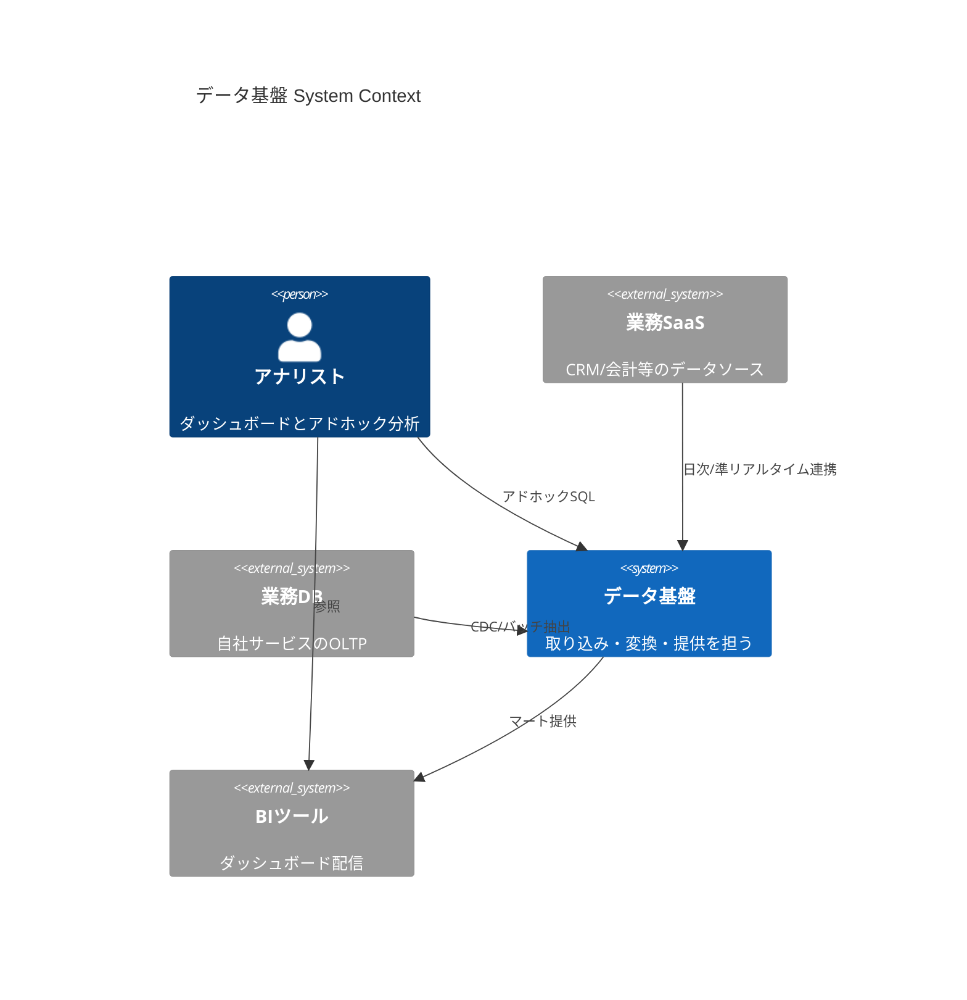
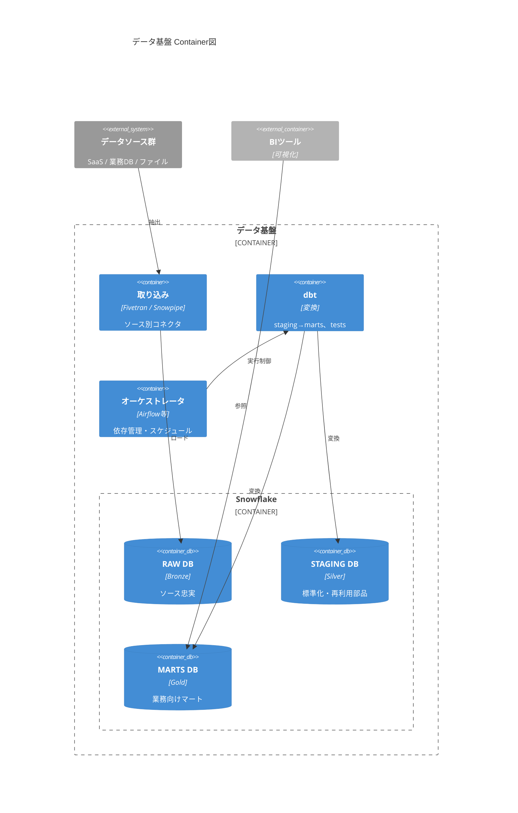

# C4×Mermaid 作図ガイド

設計書に埋め込むアーキテクチャ図の作り方。C4モデルの抽象度とMermaidのC4記法を使う。

## 方針

- **Context図とContainer図で大半のケースは十分**。Component図は特定の内部構造に
  設計判断が集中しているときだけ描く。Code図は描かない。
- C4のレベルは「図の抽象度」であり、成果物を分割する単位ではない。
  1つの設計書にContext図とContainer図を順に載せる。
- 多数のシステムが関わる場合、1枚に詰め込まず焦点ごとに複数の図に分割する。
- MermaidはGitHub/多くのMarkdownビューアで直接レンダリングされるため、
  設計書(Markdown)への埋め込みに適する。

## Mermaid C4記法の注意

- `C4Context` / `C4Container` / `C4Component` 記法は**実験的**であり、
  公式が「構文・プロパティは変更されうる」「レイアウトは全自動ではなく
  記述順に依存する」と明記している。
- **図が崩れたら要素の宣言順を入れ替える**。これが主なレイアウト調整手段。
- `UpdateLayoutConfig($c4ShapeInRow="3")` で1行あたりの要素数を調整できる。
- 厳密なレイアウト制御や大規模図が必要なら、Structurizr DSLやPlantUMLへの
  切り替えを提案する。

## Context図の例(データ基盤)

登場人物: データ生産者(業務システム・SaaS)、データ基盤、データ消費者
(アナリスト・BIツール・外部共有先)。

## Container図の例(Snowflake中心の構成)

コンテナ粒度: 取り込み層 / DWH(レイヤー別DB・ウェアハウス群)/ 変換 /
オーケストレータ / BI / カタログ。

ウェアハウス分離(ETL用/BI用等)を図で示したい場合は、Container図に詰め込まず
設計書の構成要素の表で扱うか、焦点を絞った別図にする。

## 出力時のセルフチェック

- [ ] 図の各要素が本文の構成要素と対応している(図にだけ登場する要素がない)
- [ ] 矢印に説明ラベルがある(「連携」だけの矢印を残さない)
- [ ] Context→Containerで抽象度が正しく下がっている(Contextに製品名を書きすぎない)
- [ ] レンダリングを確認した(崩れる場合は宣言順を調整した)
