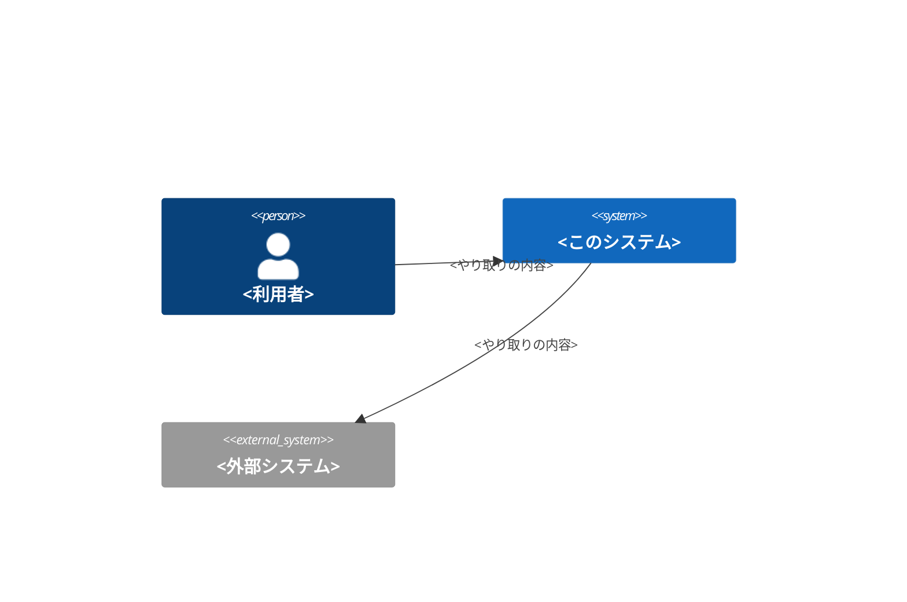
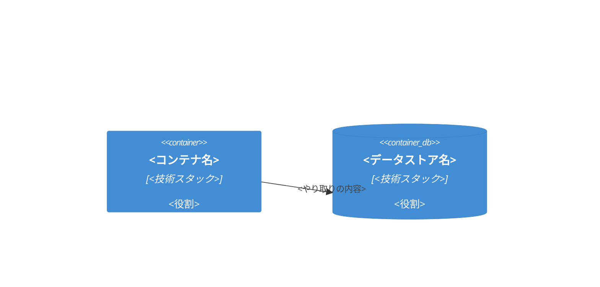

# <対象システム名> アーキテクチャ図

- Owner: <個人またはチーム名>
- Last reviewed: `YYYY-MM-DD`

<!-- 更新時の注意: この図はコードと同じPRで更新する。実装と乖離した図は放置しない -->

## Context図

## Container図

## 要素の説明

| 要素 | 役割 |
|---|---|
| <要素名> | <説明> |
