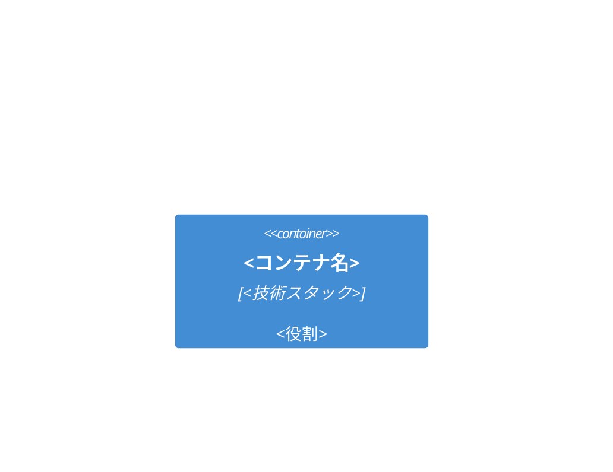

# <タイトル>

- Owner: <個人またはチーム名>
- Last reviewed: `YYYY-MM-DD`
- Status: Draft <!-- Draft / In Review / Approved / Obsolete -->
- 著者: / レビュアー: / 関連文書: (PRD、親Design Doc、ADR)

## 概要(Context and Scope)

<新規読者が前提知識ゼロで読める客観的な背景。3〜5段落以内>

## 目標と非目標(Goals / Non-Goals)

### 目標

- <計測可能な目標(例: 検索P95を800msから300msにする)>

### 非目標

- <合理的にあり得るが、あえてやらないこと>

## 設計(The Actual Design)

### システム構成図

### <トピック別サブセクション(API・データモデル・処理フロー等)>

<なぜこの設計にしたのか(トレードオフ)を必ず書く>

## 代替案(Alternatives Considered)

| 代替案 | 利点 | 欠点 | 不採用理由 |
|---|---|---|---|
| <検討した案> | | | |

## 横断的関心事(Cross-cutting Concerns)

- セキュリティ:
- プライバシー:
- 可観測性:
- 国際化:
- ストレージ・コスト見積り:

## マイルストーン・移行計画

<段階的リリース、既存システムからの移行、ロールバック手段>

## 未解決の問題(Open Questions)

- <レビューで議論したい論点>
