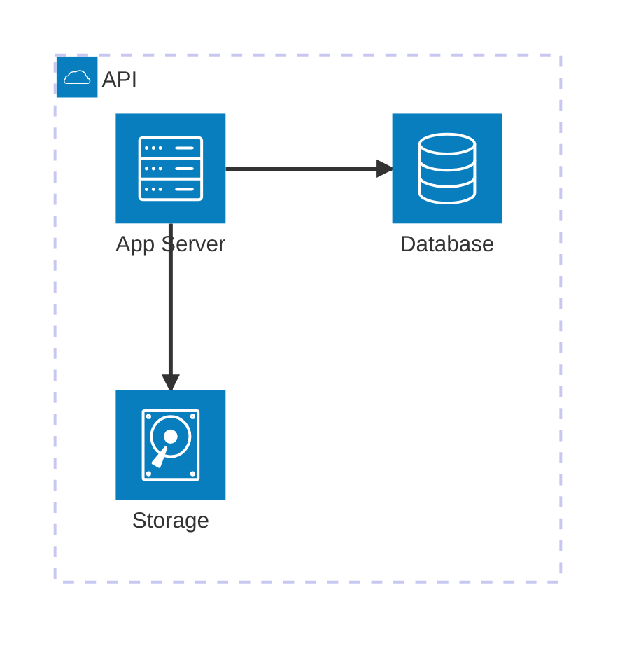
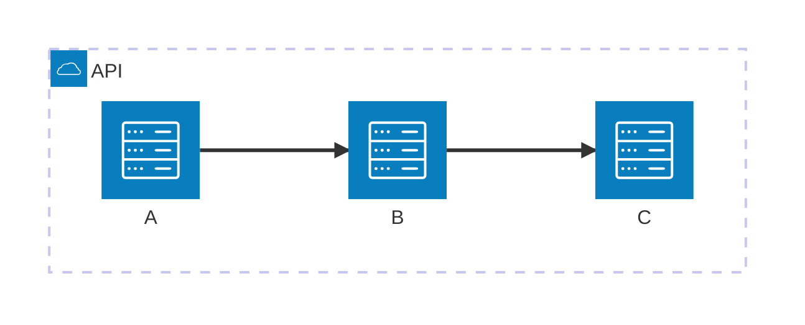

# architecture-beta の書き方

`mermaid-diagrams/SKILL.md` の詳細ガイド。architecture-beta(v11.1.0+)は
クラウドインフラ図・サービス/リソース関係の表現に特化した図種で、公式に
**beta**扱い。ビルディングブロックはgroups(論理的な境界) / services(個々の
要素) / edges(関係) / junctions(分岐点)。

## 基本構文

エッジは方向をポート(`L`/`R`/`T`/`B`)で指定する。片側に`<`/`>`を付けると
矢印になる(例: `db:R --> L:server`)。

## アイコンの制約(最重要)

**組み込みアイコンは`cloud`・`database`・`disk`・`internet`・`server`の
5つのみ**であり、これらは全レンダラーで動く。それ以外のアイコン
(Iconify経由の`logos:aws-lambda`等、200,000以上のアイコンセットが利用可能)は
`mermaid.registerIconPacks()`を**レンダリング時に登録する必要があり**、GitHub
等の静的レンダラーでは登録されないため描画されず「?」表示になる。

実務判断: ドキュメントがGitHubで読まれるなら組み込み5アイコンのみを使う。
ローカル/自前サイトでSVGを生成するならIconifyで高品質化してよい。AWSアイコンは
`@iconify-json/logos`(AWS部分集合)や、855個のAWSアイコンを提供する
harmalh/aws-mermaid-icons(登録名`aws`)などから登録できる。

## 兄弟ノードの重なり問題

fcoseレイアウトを使うため、論理的に同座標に置かれた兄弟ノードが重なる既知の
制限がある(公式ドキュメントの#6120)。`randomize`/`seed`/
`idealEdgeLengthMultiplier`等のノブでは解消できない場合、v11.16.0で追加された
`align row`/`align column`ディレクティブを使う。

## 設計指針

少数サービスへの分割を公式も推奨している。1図に詰め込みすぎず、
`large-diagram-layout.md`の原則(1図1関心事)に従う。architecture-betaは
「レイアウトを記法に統合している」設計自体への批判もあり、安定版化前に
仕様が変わる可能性がある点に留意する。

## テーマ変数

architecture-beta固有のテーマ変数として`archEdgeColor`・
`archEdgeArrowColor`・`archGroupBorderColor`等がある。全般的なテーマの
扱いは`theming-icons-guide.md`を参照。
