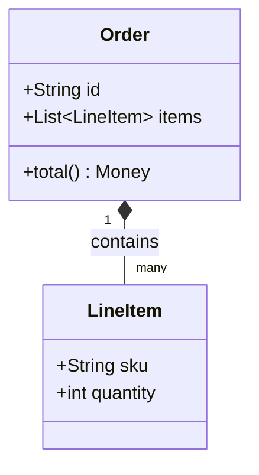
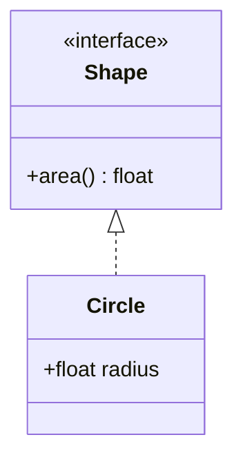

# classDiagram の書き方

`mermaid-diagrams/SKILL.md` の詳細ガイド。クラス構造・ドメインモデルの表現に
使う図種。安定しているが、アーキテクチャ図全体像には不向き。

## 基本構文

## 可視性修飾子

`+`(public)・`-`(private)・`#`(protected)・`~`(package)をメンバー名の前に
付ける。

## 関係の矢印

| 記法 | 意味 |
|---|---|
| `<\|--` | 継承(inheritance) |
| `*--` | コンポジション |
| `o--` | 集約(aggregation) |
| `-->` | 関連(association) |
| `..>` | 依存(dependency) |
| `..\|>` | 実現(realization) |

## ステレオタイプ・ジェネリクス

`<<interface>>`・`<<abstract>>`のようなステレオタイプはクラス本体内に記述する。
ジェネリクスは`List~LineItem~`のようにチルダで囲む(`<>`ではない。`<`/`>`は
SKILL.md本体のチェックリスト通りHTMLタグと誤認されるため、Mermaidの
classDiagramではジェネリクス専用にチルダ記法が用意されている)。

## namespace(v11.14.0以降の変更)

v11.14.0以降、`namespace`はドット記法でネスト対応するようになった。旧来の
挙動が必要な場合は`class.hierarchicalNamespaces=false`で維持できる。この点は
バージョン依存の挙動のため、対象レンダラーのMermaidバージョンが古い場合は
挙動が異なる可能性がある(`rendering-compatibility-guide.md`参照)。
