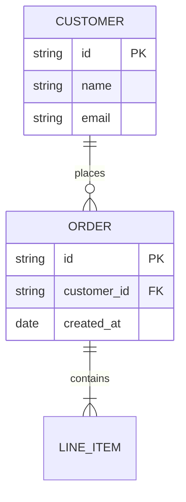

# erDiagram の書き方

`mermaid-diagrams/SKILL.md` の詳細ガイド。DBスキーマ・データモデルの表現に
使う図種。安定しているが、アーキテクチャ図全体像には不向き(サービス構成を
描きたいならflowchartかarchitecture-betaを使う)。

## 基本構文

## カーディナリティ記法(UML記法とは異なる)

| 記法 | 意味 |
|---|---|
| `\|o--o\|` | 0か1 対 0か1 |
| `\|\|--\|\|` | 1 対 1 |
| `}o--o{` | 0以上 対 0以上 |
| `}\|--\|{` | 1以上 対 1以上 |
| `\|\|--o{` | 1 対 0以上 |

Mermaidの`erDiagram`はUMLのカーディナリティ記法とは見た目が異なる独自記法
であるため、慣れていない場合は上表を参照して都度確認する。

## 属性ブロックとキー修飾子

エンティティ名の後に`{ }`で属性を列挙できる。型と属性名の後に`PK`
(主キー)・`FK`(外部キー)・`UK`(一意キー)を付けられる。

## 構文の落とし穴

エンティティ名・属性名が予約語や`default`のような衝突しやすい語と一致する
場合は、SKILL.md本体の構文チェックリストと同様にラベル/表示名を分けるか、
ダブルクォートで囲む。リレーション名(`: "places"`のようなラベル)に
`()`・`:`・`,`を含む場合もダブルクォート必須。
