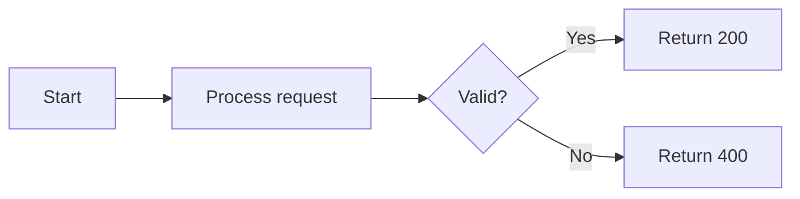
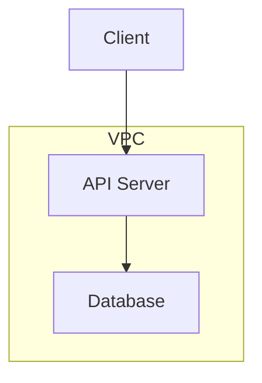
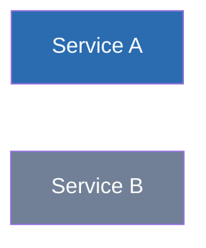

# flowchart / graph の書き方

`mermaid-diagrams/SKILL.md` の詳細ガイド。flowchart(`graph`と同義)は
Mermaidの中で最も安定しており、全レンダラーで動く。GitHub README にインライン
描画する前提のドキュメントでは、これをデフォルトの図種にする。

## 基本構文



矢印の種類: `-->`(実線)、`-.->`(点線)、`==>`(太線)。ラベル付き矢印は
`-->|"label"|`。

## subgraph で論理的境界を表現する



subgraphはVPC・サブネット・レイヤーなど論理的な境界の表現に使う。ただし
**subgraph内の`direction`指定は、外部ノードとリンクがあると無視され、
親グラフの方向を継承する**(公式仕様)。加えて次のような既知の不安定挙動が
複数のIssueで報告されている。

- TB/LRが逆に描画される(#7477)
- direction指定そのものが無視される(#6438・#3096)
- ネストしたsubgraphで挙動が不安定になる(#4648・#2789)

これらはMermaidのバージョンにより挙動が変わる可能性があるため、**レイアウトを
directionに依存しない設計にする**。境界を明示したいだけならdirectionを
指定せず、親グラフの方向に任せる。

## 構文の落とし穴(SKILL.md本体のチェックリストのflowchart版)

```text
NG:  flowchart LR
     start --> end
OK:  flowchart LR
     start --> End
```

小文字の`end`はフローチャートを壊す。唯一公式ドキュメントが明示する予約語。

```text
NG:  graph LR
     a --> default
OK:  graph LR
     a --> default_node["default"]
```

`default`はノードIDとして使うとレンダリングを壊す(未文書化の既知の衝突)。

```text
NG:  A[Fuel Pellets (UO2 / MOX)]
OK:  A["Fuel Pellets (UO2 / MOX)"]
```

`()`・`:`・`,`・`{}`を含むラベルはダブルクォート必須。

```text
NG:  dev---ops
OK:  dev---Ops
```

接続先が`o`/`x`で始まると`---o`が円エッジ、`---x`が交差エッジと誤認識される。

## スタイリング

`classDef`でクラスを定義し、`class`(または`:::`演算子)で適用する。インライン
`style`より保守性が高い。



クラス名は大文字小文字を区別する(`classDef myStyle`を`class A MyStyle`で
参照すると効かない)。色はhex必須(色名は無効)。テーマ変数の詳細は
`theming-icons-guide.md`を参照。

## 可読性の原則

1図12ノード程度に抑え、1図1関心事(ネットワーク/コンピュート/データを分ける)
にする。ノード数や分割の目安は`large-diagram-layout.md`を参照。
