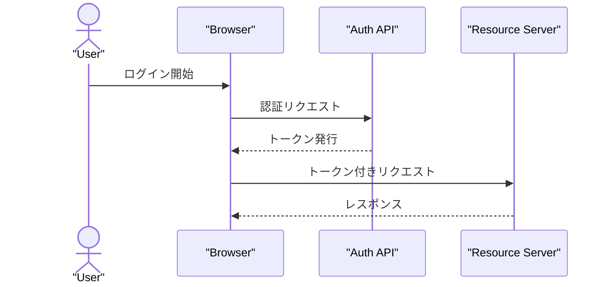
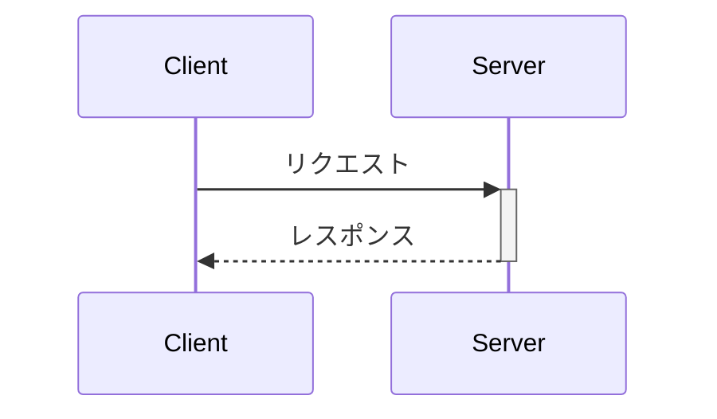
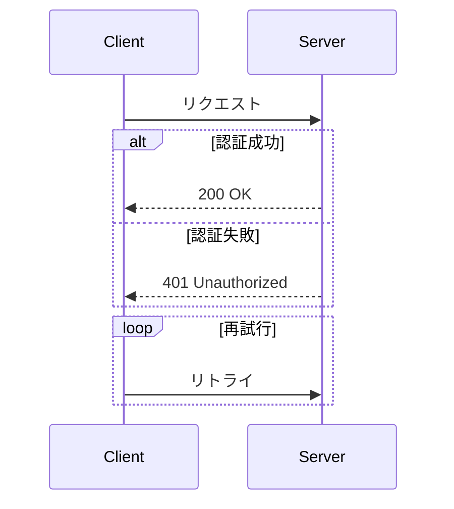
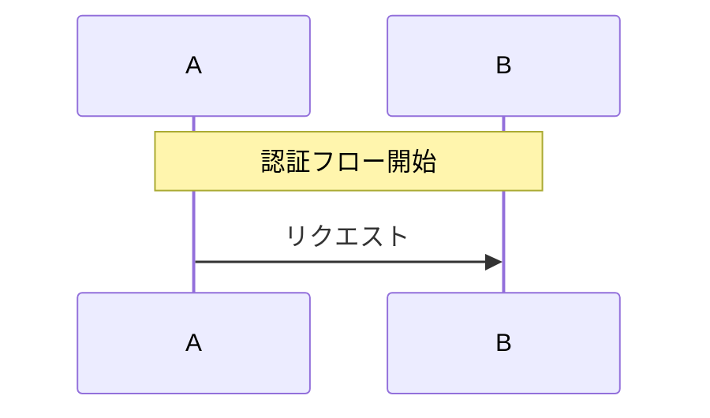

# sequenceDiagram の書き方

`mermaid-diagrams/SKILL.md` の詳細ガイド。API相互作用・認証フロー・
イベントフローなど、時系列のやり取りを表現する図種。安定しており、構造図
(flowchart等)ではなく相互作用図であることに注意する(システム構成全体を
示したいならflowchartや`dev-docs-writing`のC4図を検討する)。

## 基本構文

`participant`は宣言順に左から並ぶ。`actor`は人型アイコンで表示される。
実線矢印`->>`は同期呼び出し、破線矢印`-->>`は応答/非同期を表すのが慣習。

## 活性化(activation)

`->>+`で活性化開始、`-->>-`で活性化終了。呼び出し中の処理時間を縦棒で
明示できる。

## 条件分岐・繰り返し

`alt`/`else`/`end`で条件分岐、`opt`で任意処理、`loop`で繰り返しを表現する。
`end`は予約語だが、ここではブロックの終端キーワードとして正しい用法であり
問題ない(ノード名やラベルとして単独で`end`を使う場合のみ大文字化が必要)。

## 注釈と自動採番

`Note over A,B: ...`で複数参加者にまたがる注釈を付けられる。`autonumber`を
先頭に置くとメッセージに自動採番できる。近年のバージョンでは小数の開始値・
増分にも対応している。

## ラベル・特殊文字の扱い

メッセージテキストに`:`を含む場合は行全体の区切りと誤認されないよう注意する
(メッセージの`:`以降がテキストとして扱われるため、コロン自体は問題ないが
コロンの前にコロンを含めたい場合は避ける)。日本語ラベルはSKILL.md本体の
チェックリストの通り基本的にそのまま安全だが、迷ったら引用符付きの
`participant X as "表示名"`形式を使う。
