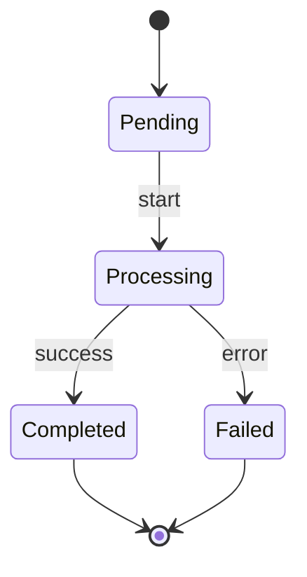
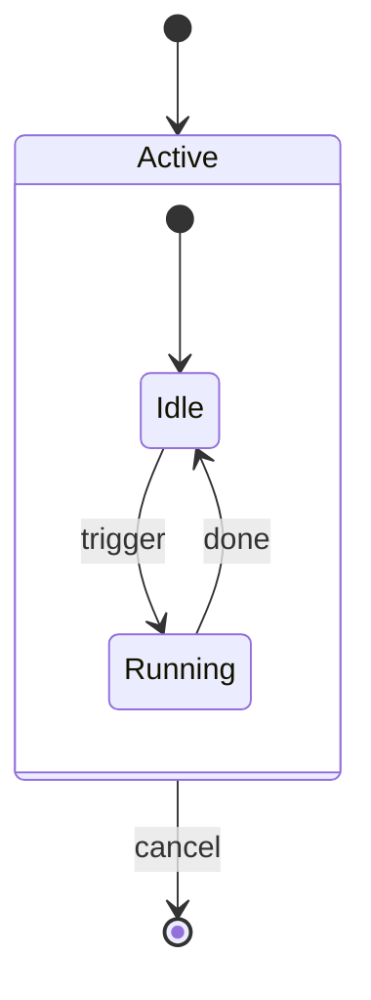
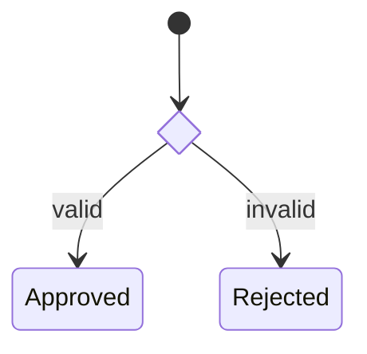

# stateDiagram-v2 の書き方

`mermaid-diagrams/SKILL.md` の詳細ガイド。状態遷移・ライフサイクルの表現に
使う図種。安定しているが、システム構成図には不向き。

## 基本構文

`[*]`は開始/終了の擬似状態を表す。

## 複合状態(ネスト)

## 分岐(choice)・並行(fork/join)

`<<choice>>`で条件分岐、`<<fork>>`/`<<join>>`で並行処理の分岐・合流を表現する。

## 構文の落とし穴

状態名に`end`を単独で使うと予約語衝突の対象になり得るため、SKILL.md本体の
チェックリスト通り大文字化した名前を使う。遷移ラベル(`:`以降のテキスト)に
`()`・`,`・`{}`を含む場合はダブルクォートで囲む。
