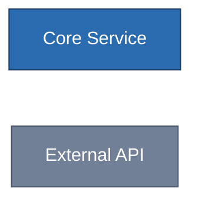

# テーマ・スタイリング・アイコンのカスタマイズ

`mermaid-diagrams/SKILL.md` の詳細ガイド。

## themeVariables

`themeVariables`は**baseテーマでのみ有効**(他のテーマでは無効)。
`primaryColor`・`lineColor`・`fontSize`等を上書きする。多くの派生色
(border等)はprimary系から自動計算される。

```text
---
config:
  theme: base
  themeVariables:
    primaryColor: "#2b6cb0"
    lineColor: "#718096"
---
```

**色はhex必須**。`red`のような色名は無効(`#ff0000`はOK)。

適用方法は3種類ある。

1. サイト全体: `mermaid.initialize({...})`
2. 図単位のfrontmatter config(上記の`--- config: ... ---`、推奨)
3. init directive: `%%{init: {"theme": "base", "themeVariables": {...}}}%%`

frontmatter configが優先度最高。

## classDef / class によるスタイリング

インラインの`style`より`classDef`でクラス定義し`class`(または`:::`演算子)で
適用するほうが保守性が高い。



**クラス名は大文字小文字を区別する**。`classDef myStyle`を
`class A MyStyle`で参照すると効かない。`linkStyle`でリンクの色・太さを
個別に指定できる。

## アイコン(architecture-beta)

`architecture-beta-guide.md`で詳述している通り、組み込みアイコンは
`cloud`・`database`・`disk`・`internet`・`server`の5つのみが全レンダラーで
安全に動く。Iconify(iconify.design)経由の`logos:aws-lambda`等は
`mermaid.registerIconPacks()`をレンダリング時に登録する必要があり、GitHub等の
静的レンダラーでは描画されない(「?」マーク表示になる)。

実務判断: ドキュメントがGitHubで読まれるなら組み込みアイコンのみを使う。
ローカル/自前サイトでSVGを生成するならIconifyで高品質化してよい。
